# Lab 2: Define Your Users in Okta

## Objective

Create and manage users in Okta by configuring custom user attributes, creating user accounts, managing account lifecycle statuses, and testing profile attribute mappings.

---

## Steps Performed

- Added a custom Region attribute to the Okta user profile
- Created a new Okta user account
- Updated user profile attributes
- Activated the user account
- Viewed user lifecycle activity
- Reset a user password
- Created a temporary password
- Expired a user password
- Suspended and deactivated a user account
- Reviewed Okta profile mappings
- Tested attribute synchronization between Okta and Okta Workflows

---

## Key IAM Concepts

- User provisioning
- Custom user attributes
- Identity lifecycle management
- Password reset workflows
- Account status management
- User suspension and deactivation
- Attribute mapping
- Identity synchronization
- Source of truth behavior

---

## Screenshots

### Custom Attribute Creation

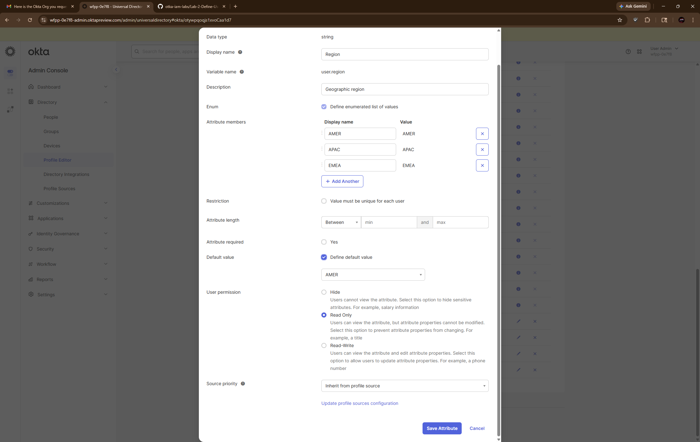

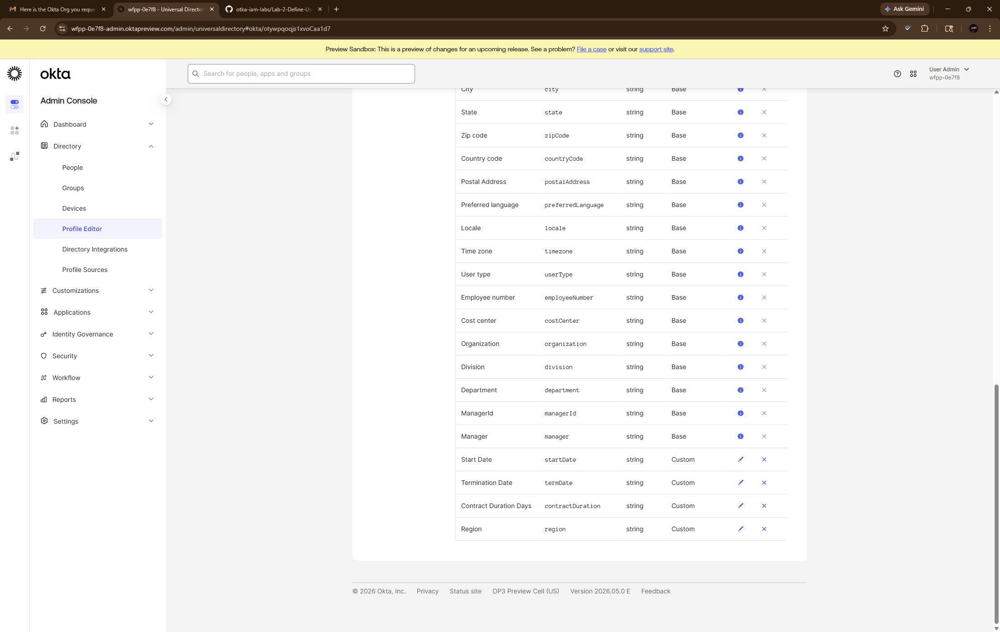

---

### User Creation and Activation

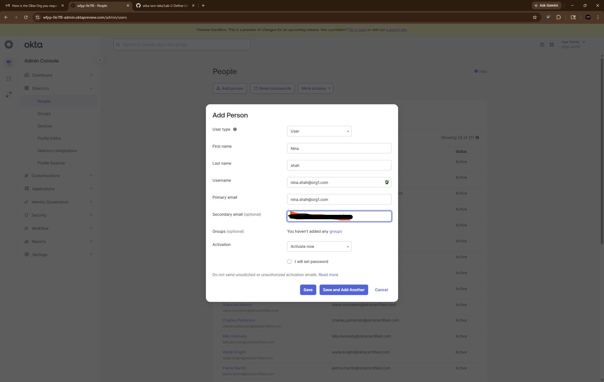

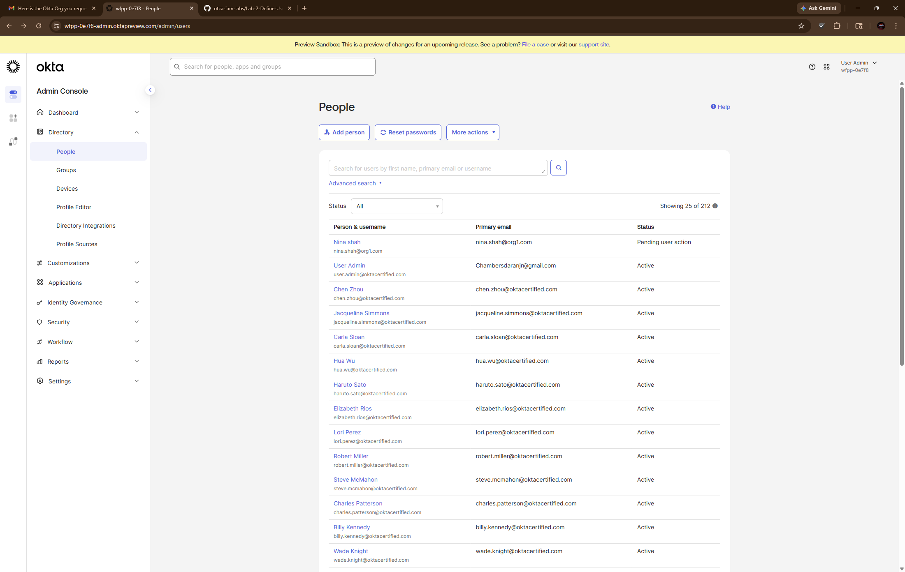

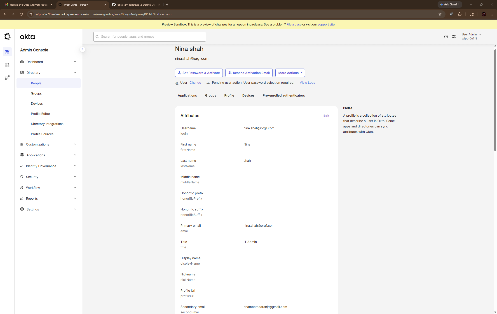

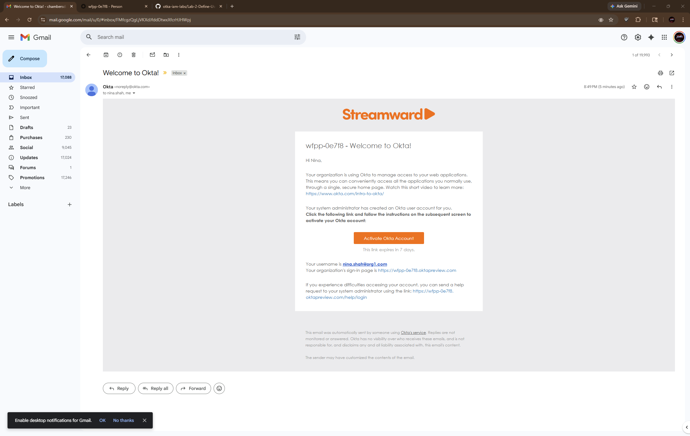

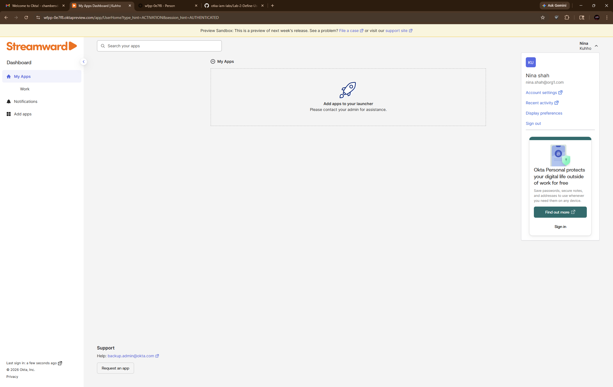

---

### User Lifecycle Activity

---

### Password and Account Status Management

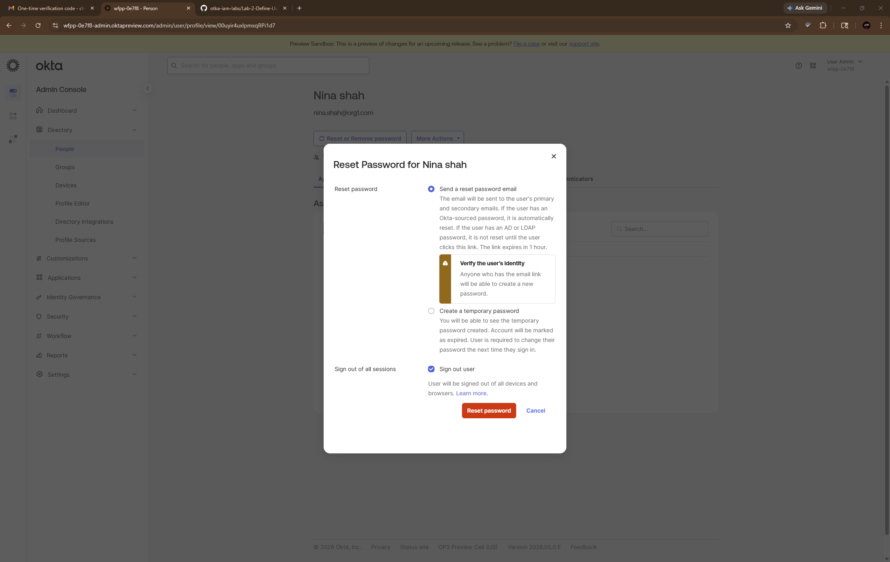

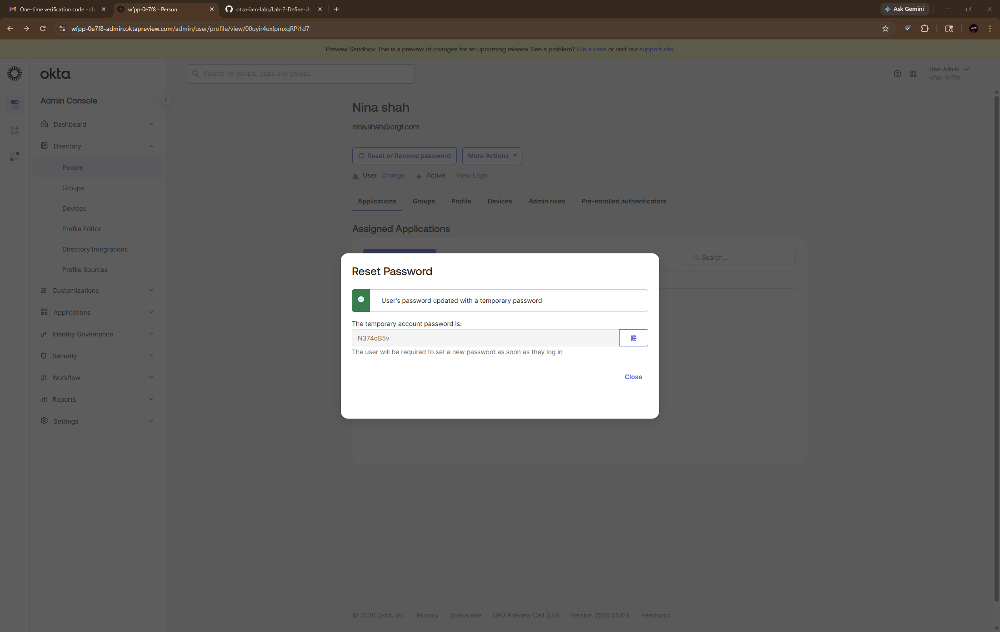

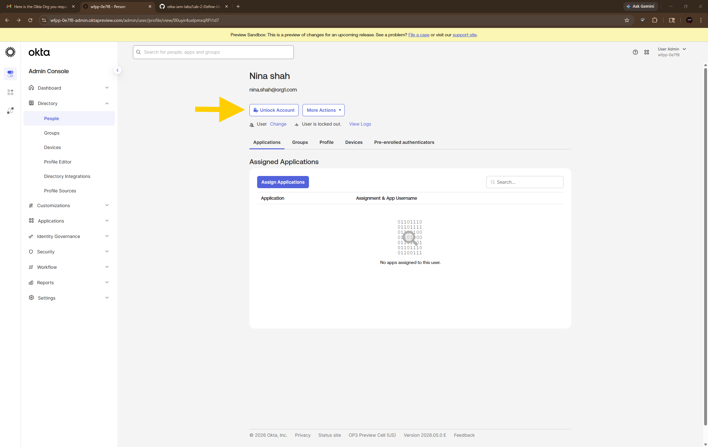

---

### Suspension and Deactivation

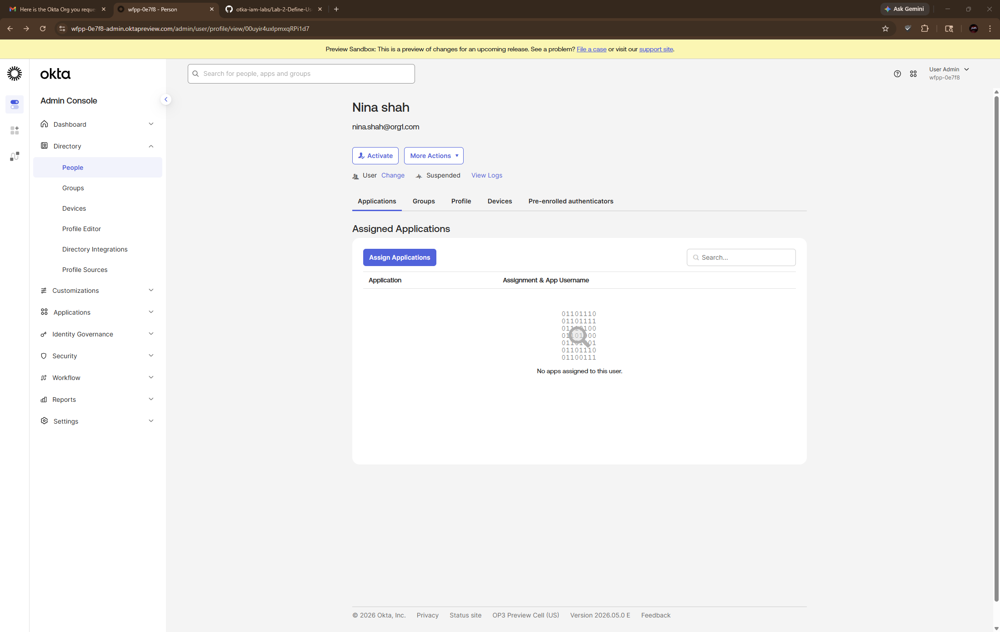

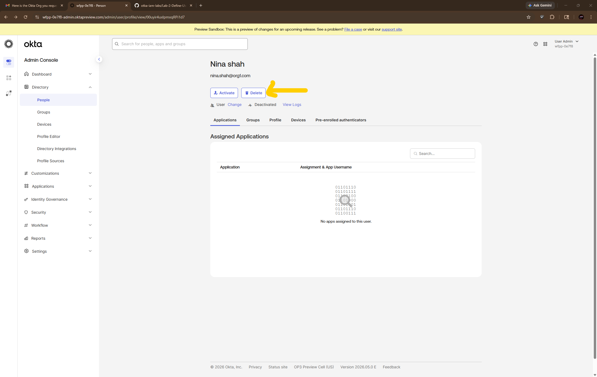

---

### Attribute Mapping and Synchronization

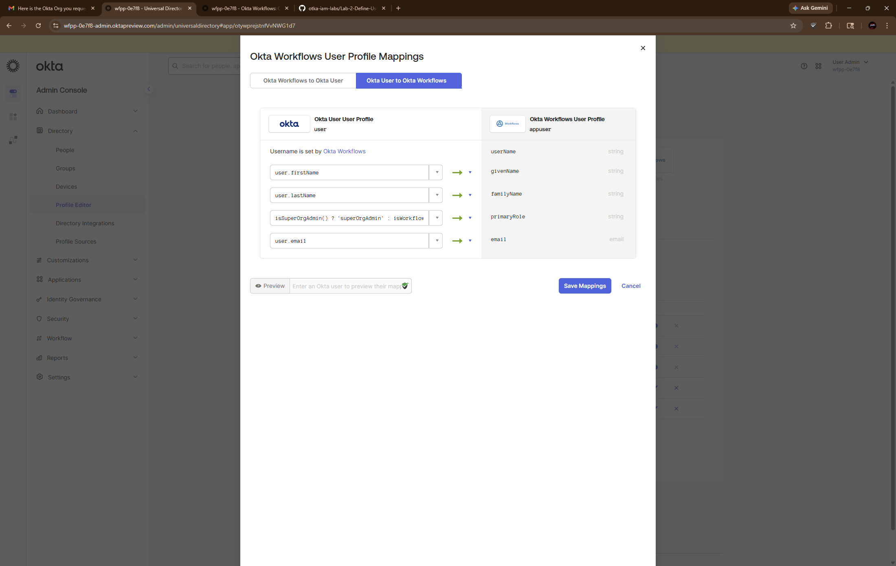

---

## What I Learned

- Custom attributes help structure identity data for users in Okta.
- User lifecycle statuses show where an identity is in the onboarding, recovery, or offboarding process.
- Password reset and temporary password workflows are common IAM support operations.
- Suspending and deactivating users helps reduce access risk during offboarding.
- Attribute mappings control how identity data syncs between Okta and connected applications.
- Okta can act as a source of truth for downstream identity data.

---

## Real-World Use Case

Organizations use Okta user management to:

- Onboard employees into centralized identity systems
- Assign user attributes for access control and automation
- Recover user accounts through password reset workflows
- Lock, suspend, or deactivate accounts for security reasons
- Synchronize identity data across connected applications
- Support secure user lifecycle management
