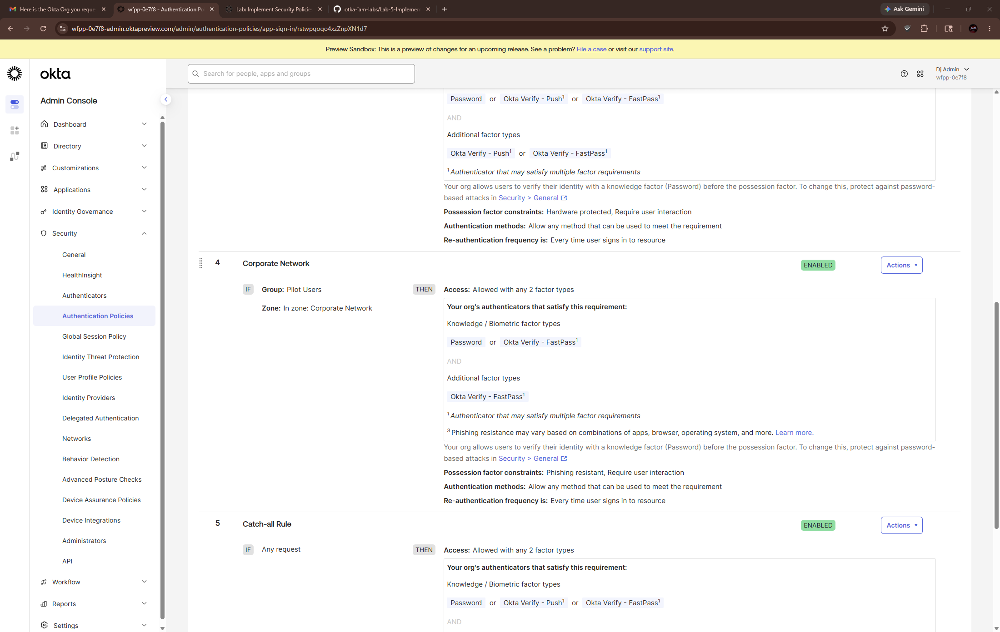

# Lab 5: Implement Security Policies in Okta

## Overview
This lab focused on implementing layered security controls in Okta using authentication policies, network zones, MFA enrollment rules, session management, and password policies.

The objective was to strengthen organizational security posture by enforcing conditional access based on location, authentication methods, and device trust.

---

## Technologies Used
- Okta Admin Console
- Okta Verify
- Google Authenticator
- Network Zones
- Authentication Policies
- Authenticator Enrollment Policies
- Password Policies
- System Log Monitoring

---

## Security Policies Implemented

### Network Zones
- Corporate Network IP Zone
- Allowed Countries Dynamic Zone

### MFA & Authenticators
- Google Authenticator
- Okta Verify
- Device verification enforcement

### Enrollment Policies
- Allowed enrollment from approved countries
- Denied enrollment outside approved locations

### Authentication Policies
- Restricted country access blocking
- Public network MFA enforcement
- Corporate network conditional access

### Session Security
- 12-hour session lifetime
- 30-minute idle timeout
- Disabled persistent session cookies

### Password Security
- Minimum 12-character passwords
- Password history enforcement
- Common password restriction
- Account lockout protection
- Self-service password recovery controls

---

## Screenshots

### Corporate Network Zone

### Allowed Countries Zone

### Okta Verify Settings

### Enrollment Policy

### Public Network Rule

### Corporate Network Rule

### Password Policy

### System Log Events

---

## What I Learned
- How network zones influence authentication decisions
- How MFA policies differ between trusted and untrusted networks
- How Okta evaluates sign-on policy rules
- How session and password policies improve identity security
- How authentication policies support Zero Trust security models

---

## Real-World Use Case
Organizations use these security controls to enforce MFA, reduce unauthorized access, protect accounts from risky sign-ins, and implement location-aware authentication policies.
## Pending Validation / Follow-Up

### Device Registration Testing

This section was reviewed conceptually but full validation was not completed during the initial walkthrough due to unavailable preconfigured training users and enrolled devices.

### Planned Follow-Up
- Create test user
- Assign Okta access
- Enroll Okta Verify
- Register device
- Test device removal and re-enrollment
- Review Directory → Devices
- Validate Reset Authenticators workflow

### Status
⚠️ Pending Hands-On Validation

## Pending Validation

### Okta Dashboard Authentication Policy Testing

Policy rules were successfully configured but full validation testing was deferred due to the absence of a dedicated pilot test user with enrolled MFA and dashboard access.

### Planned Validation
- Create pilot test user
- Assign Okta Dashboard access
- Add user to Pilot Users group
- Enroll Okta Verify
- Test Public Network rule
- Test Corporate Network rule
- Validate System Log policy evaluation events

### Status
⚠️ Pending Hands-On Validation
