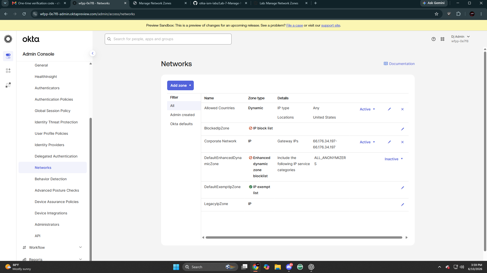
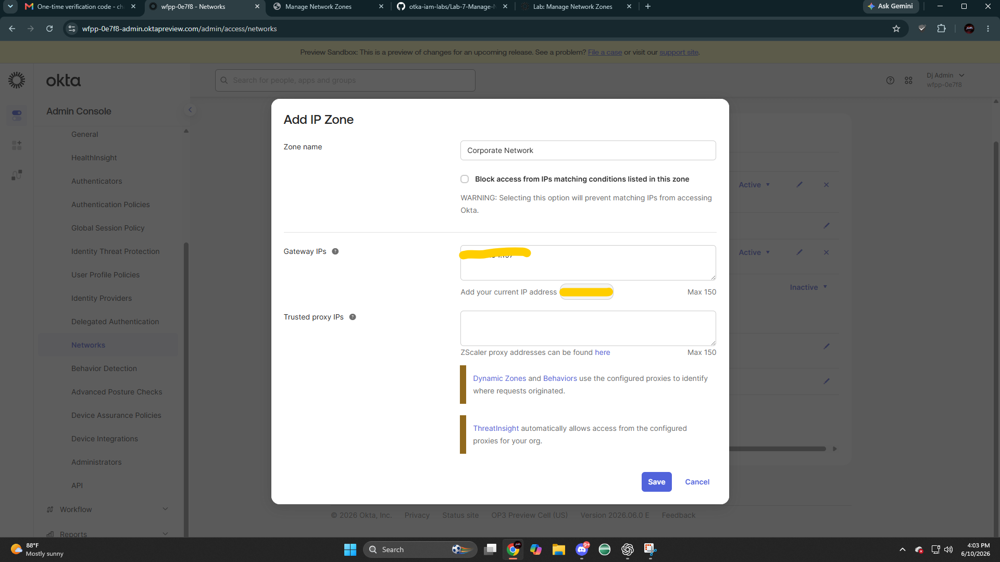
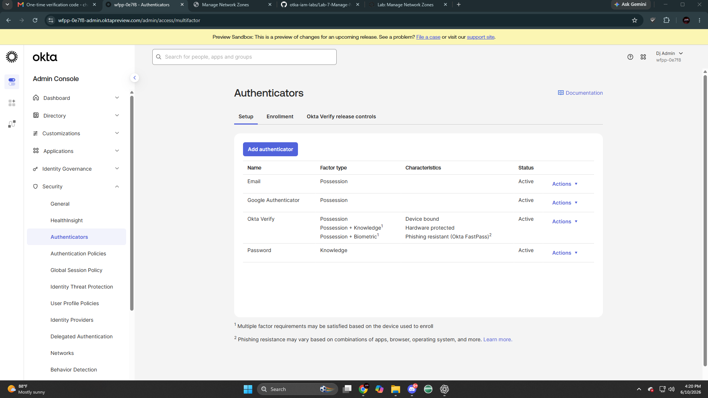

# Lab 7: Manage Network Zones

## Overview

This lab demonstrates how to configure and manage Okta Network Zones to enforce authentication policies based on user location, IP address, and network risk.

## Objectives

- Create an IP Network Zone for a corporate network
- Create a Dynamic Zone for allowed countries
- Enable Okta Verify Push Notification
- Configure authentication policy rules using Network Zones
- Test public and corporate network access
- Block Tor anonymizer traffic

## Technologies Used

- Okta Workforce Identity Cloud
- Network Zones
- Dynamic Zones
- Authentication Policies
- Okta Verify
- System Log

## Skills Demonstrated

- Okta Administration
- Identity and Access Management (IAM)
- Conditional Access
- MFA Enforcement
- Zero Trust Security
- Authentication Policy Configuration

## Screenshots

## Screenshots

### Security Networks Page

Navigated to Security > Networks to begin configuring Okta Network Zones.

### Add IP Zone

Created an IP Network Zone for the corporate network.

### System Log Country Lookup

Reviewed authentication activity in the System Log to identify the country/region for the Allowed Countries Dynamic Zone.

### Add Dynamic Zone

Created a Dynamic Network Zone for allowed countries.

### Okta Verify Settings

Opened the Okta Verify authenticator settings to modify available verification methods.

### Okta Verify Enabled Options

Enabled TOTP, Push Notification, and Okta FastPass for Okta Verify.

### Okta Dashboard Policy

Opened the Okta Dashboard authentication policy to configure network-based access rules.

### Restricted Countries Rule

Created a Restricted Countries rule to deny access when Pilot Users sign in from outside the Allowed Countries zone.
## Lessons Learned

This lab strengthened my understanding of how Okta uses Network Zones and authentication policies to enforce location-based access controls and reduce authentication risk.
